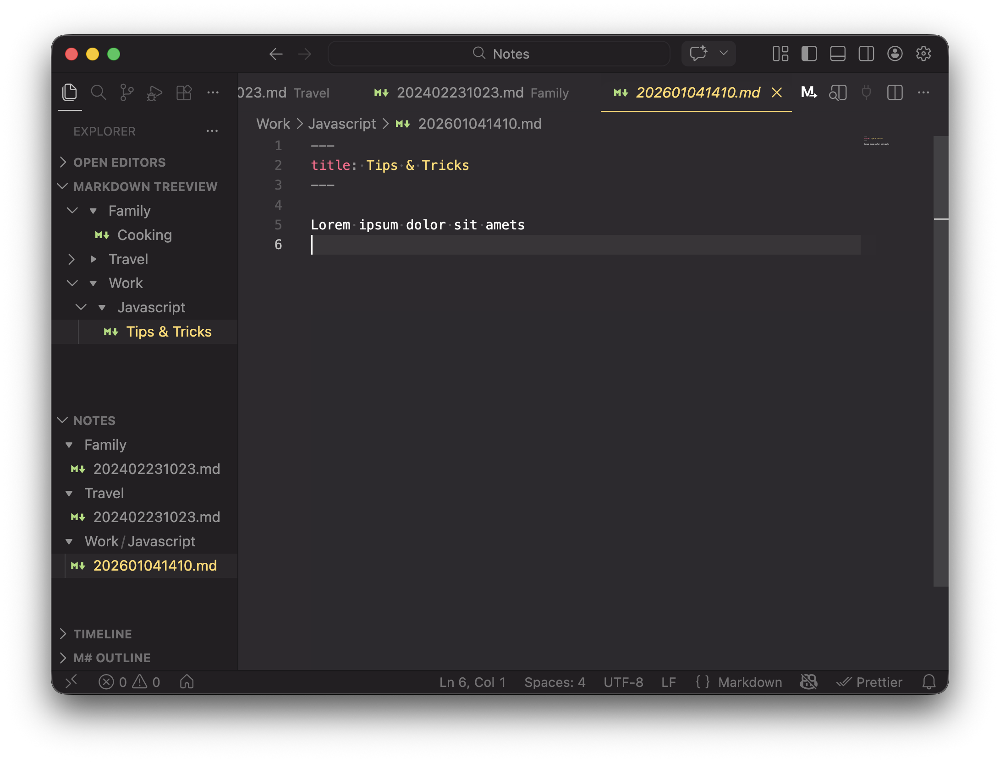

# Markdown TreeView

This extension is used to show a tree of markdown files, named by the first header or frontmatter
title entry.

## Feature

This extension creates a new Tree Viewer. It shows all Markdown files within the workspace
folder(s). Instead of the real filenames the value of the first # header entry or if it exists, a
frontmatter title entry is used.

- Update the tree on file save
- Refresh the tree with command
- Use # Header Text or Frontmatter yaml style title for naming
